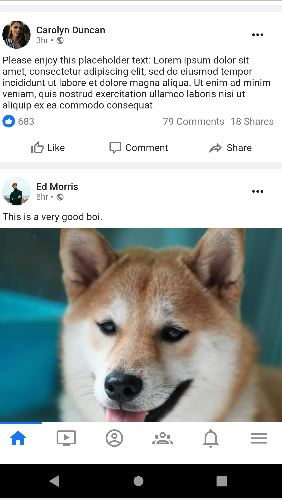

<samp>

# 
Facebook Clone Responsive UI - Flutter

# 
Web & Mobile: IOS | Android

## 
Web Version with Flutter!

- ### This web version uses flutter.

## 
Mobile Version: Android | IOS

## 
@luanbatistadev

</samp>